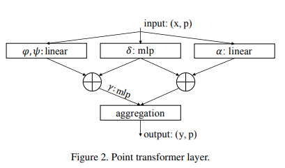

</img>

## Point Transformer - Pytorch

Implementation of the <a href="https://arxiv.org/abs/2012.09164">Point Transformer</a> self-attention layer, in Pytorch. The simple circuit above seemed to have allowed their group to outperform all previous methods in point cloud classification and segmentation.

## Install

```bash
$ pip install point-transformer-pytorch
```

## Usage

```python
import torch
from point_transformer_pytorch import PointTransformerLayer

attn = PointTransformerLayer(
    dim = 128,
    pos_mlp_hidden_dim = 64,
    attn_mlp_hidden_mult = 4
)

x = torch.randn(1, 16, 128)
pos = torch.randn(1, 16, 3)

attn(x, pos) # (1, 16, 128)
```

## Citations

```bibtex
@misc{zhao2020point,
    title={Point Transformer}, 
    author={Hengshuang Zhao and Li Jiang and Jiaya Jia and Philip Torr and Vladlen Koltun},
    year={2020},
    eprint={2012.09164},
    archivePrefix={arXiv},
    primaryClass={cs.CV}
}
```
